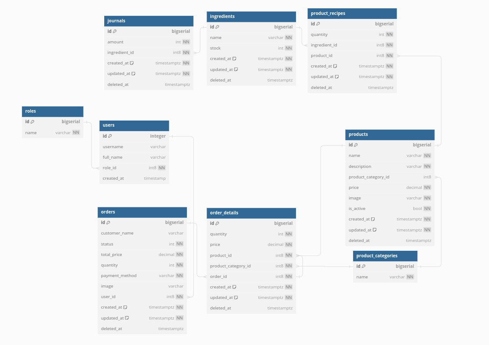

## There will be cashier, server, admin, and manager
1. As a server, they would be able to add product and its quantity to the order
2. As a server, they would be able to add customer name
3. As a server, they would be able to tell the customer 
the total price of the order
4. As a server, they would be able to tell the customer that the product stock is out of stock
5. As a cashier, they would be able to able to accept payment and change the order status to paid
6. As a cashier, they would be able to able to print order detail
7. As an admin, they would be able to add a new menu (products)
8. As an admin, they would be able to update ingredient stocks manually
9. As an admin, they would be able to see stock changes journal
10. As an admin, they would be able to see weekly and monthly sales report
11. As a manager, they would be able to adjust the quantity of used ingredients in product recipe
12. As a manager, they would be able to see stock changes journal
13. As a manager, they would be able to see weekly and monthly sales report